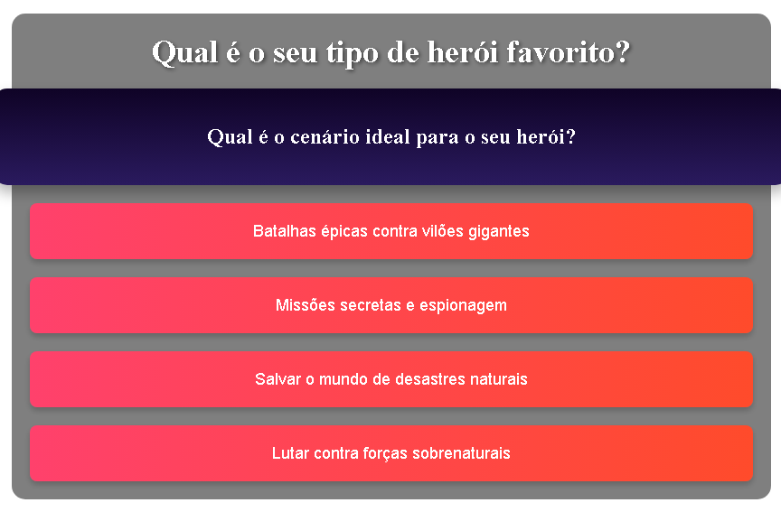

# 
Quiz App - Bem-vindo ao Quiz Descubra seu Herói !!!

  
 

  

**✔Clique e Descubra ** - Seu  Heroi Surpreza. Acesse agora: <a href="https://dulcet-fudge-8224cf.netlify.app/" style="font-size:120%;" target="_blank">Quiz Heroi-Favorito !!</a>

---
Bem-vindo ao **Quiz App**, um aplicativo interativo desenvolvido para determinar qual tipo de herói de quadrinhos combina mais com você com base nas suas respostas! Este projeto é uma aplicação web que utiliza Angular como framework principal, com integração de componentes React para a interface dinâmica. O quiz apresenta quatro personagens icônicos (Superman, Homem de Ferro, Flash e Doutor Estranho) como resultados possíveis, exibindo uma tela de conclusão personalizada com imagens de fundo.

---
## 📑Descrição

O projeto consiste em um quiz com quatro perguntas, cada uma com quatro opções de resposta (A, B, C, D). O resultado final é calculado com base na maioria das respostas, associando o usuário a um dos quatro heróis. A tela final inclui confetes animados (usando a biblioteca `react-confetti`) e um fundo dinâmico com a imagem do herói correspondente ao resultado, tornando a experiência visualmente atraente.

---
## 🛠 Ferramentas e Frameworks Usados

- **Angular**: Framework principal para a estrutura da aplicação, responsável pela lógica do quiz e roteamento.
- **React**: Utilizado para criar o componente `SurprisePanel`, que exibe a tela final com animações e fundo dinâmico.
- **TypeScript**: Linguagem de programação usada para adicionar tipagem estática ao código Angular e React.
- **CSS**: Estilização personalizada para criar um design harmonioso, com gradientes e transições suaves.
- **react-confetti**: Biblioteca React para adicionar efeitos de confete na tela de conclusão.
- **Node.js e npm**: Ambiente de execução e gerenciador de pacotes para instalar dependências.
- **Angular CLI**: Ferramenta de linha de comando para criar, construir e servir o projeto.
- **Visual Studio Code** (recomendado): Editor de código usado para desenvolvimento e depuração.
- **Git**: Controle de versão para gerenciar o código-fonte.

##  ✔ Pré-requisitos

- **Node.js** (versão 14.x ou superior): [Baixe aqui](https://nodejs.org/)
- **npm** (geralmente incluído com Node.js)
- **Angular CLI**: Instale globalmente com `npm install -g @angular/cli`

--- 
Uso
Responda às quatro perguntas do quiz, escolhendo uma das quatro opções em cada etapa.
Ao final, veja seu resultado (um dos quatro heróis: Superman, Homem de Ferro, Flash ou Doutor Estranho).
A tela de conclusão exibirá confetes e o fundo com a imagem do herói correspondente.
Clique em "Jogar Novamente" para reiniciar o quiz.

##Estrutura do Projeto

quiz-app/
├── src/

│   ├── app/

│   │   ├── quizz/

│   │   │   ├── quizz.component.html

│   │   │   ├── quizz.component.css

│   │   │   ├── quizz.component.ts

│   │   │   ├── react/
│   │   │   │   ├── SurprisePanel.tsx

│   │   ├── assets/

│   │   │   ├── images/
│   │   │   │   ├── superman-background.jpg

│   │   │   │   ├── ironman-background.jpg

│   │   │   │   ├── flash-background.jpg

│   │   │   │   ├── doctorstrange-background.jpg
│   │   ├── index.html

│   └── ...
├── angular.json

├── package.json

└── README.md

--- 
Desafios e Notas

Problema com Imagens de Fundo: Durante o desenvolvimento, enfrentamos dificuldades para exibir as imagens de fundo no SurprisePanel (ex.: superman-background.jpg). Apesar de estarem na pasta src/assets/images/, o Angular não as serve corretamente, resultando em erros 404 no navegador. Isso pode estar relacionado à configuração do angular.json ou ao uso de require no código React/TypeScript. A solução está em andamento e será documentada aqui após resolução.
Porta em Uso: O servidor padrão (porta 4200) pode estar em uso. Use --port 4201 ou libere a porta manualmente para evitar conflitos.
Depuração: Verifique o console do navegador (F12 > Console) para erros relacionados a imagens ou outros problemas.

Agradeço sinceramente a oportunidade de compartilhar este projeto, que, embora simples, representa um marco significativo no meu aprendizado em desenvolvimento web. Reconheço que ainda tenho um longo caminho a percorrer e muito a aprender, mas estou comprometido em continuar me dedicando e aprimorando minhas habilidades. Este projeto foi desenvolvido com a base de referncia da Aula do Pro.felipe na Dio. (
Criando um Clone do BuzzFeed com Angular ) Decola Tech 2025

